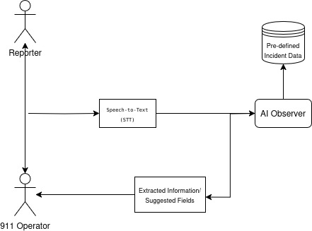

# swift911

This project implements a 911 emergency response system using a combination of speech recognition, natural language processing, and an agent-based architecture. It allows users to report incidents via voice input, extracts relevant information, and aims to dispatch appropriate resources.

## Introduction & Problem Statement

### 1.1 The Challenge: Inefficiencies and Errors in 911 Call Processing

Emergency response relies on the swift and accurate transmission of critical information from 911 callers to dispatchers. Currently, a significant portion of this information is captured through manual data entry by call takers. This process is inherently **slow and prone to human error**. Even minor inaccuracies or delays in capturing details like location, nature of the emergency, and number of people involved can have **critical consequences**, potentially delaying life-saving assistance. The manual nature of this task also places a substantial cognitive load on call takers, especially during high-volume incidents, exacerbating errors and reducing efficiency.

Specifically, the limitations of manual data entry include:

*   **Time Consumption:** Manually typing information takes valuable seconds, delaying the dispatch of emergency services.
*   **Error Rate:** Human error is inevitable, leading to inaccurate data that can misdirect responders.
*   **Scalability Issues:** During peak demand, manual processing becomes a bottleneck, impacting response times.
*   **Inconsistent Data:** Different call takers may interpret and record information differently, leading to data inconsistencies.

### 1.2 Introducing the AI-Powered Solution: Automated Information Extraction

To address these critical challenges, this project developed an AI assistant designed to **automatically extract key information from 911 call transcripts**. This solution leverages the power of Generative AI – specifically, Large Language Models (LLMs) – to process spoken language and identify crucial details. 

**This AI assistant performs the following key functions:**

*   **Automatic Speech Recognition (ASR):** Transcribes the audio from 911 calls into text.
*   **Structured Data Output:** Presents the extracted information in a standardized, machine-readable format (JSON), enabling seamless integration with dispatch systems and other downstream applications. This standardized format will allow for faster data availability and consistency, enabling better decision-making and predictive actions.


## System Overview


The following diagram illustrates the overall approach of our AI-powered emergency response system.  Audio from the caller is first transcribed into text using Speech-to-Text (STT) technology. This text is then processed by the "AI Observer," which extracts key information and structures it into predefined fields. This structured data is then available for use by the 911 operator and can be integrated with other emergency response systems.  
**IMPORTANT:** We used an AI-powered 911 operator for this demonstration, but a human will fulfill this role in practice. 
## Project Structure

*   `agents.py`: Contains the implementation of the `Operator` and `Observer` agents, responsible for handling conversations and extracting information from transcripts.
*   `conversation_fastapi.py`: Implements a FastAPI server with a WebSocket endpoint for handling real-time voice communication.
*   `incident_types.py`: Defines the data models for different types of incidents (e.g., Fire, Medical Assistance, Theft) and related information.
*   `observer.ipynb`: Contains prototyping related to the observer agent.
*   `static/conversation.html`: HTML file for the frontend interface.
*   `requirements.txt`: Lists the project dependencies.

## Getting Started

1.  **Clone the repository:**

    ```bash
    git clone https://github.com/NaifMersal/swift911.git
    ```

2.  **Install dependencies:**

    ```bash
    pip install -r requirements.txt
    ```

3.  **Set up API Keys:**

    Before running the application, you need to configure your API keys. You can do this in one of two ways:

    *   **Environment Variables:** Export the `GOOGLE_API_KEY` (for Gemini models) or `OPENAI_API_KEY` (for OpenAI models) environment variable.
    *   **.env File:** Create a `.env` file in the root directory of the project and add your API keys in the following format:

        ```
        GOOGLE_API_KEY=your_google_api_key
        OPENAI_API_KEY=your_openai_api_key
        ```

    If you plan to use Ollama, you can set any random value for `OPENAI_API_KEY` as Ollama is OpenAI compatible and doesn't require a valid API key.

4.  **Run the FastAPI server:**

    ```bash
    uvicorn conversation_fastapi:app
    ```

5.  **Open the frontend interface:**

    Open the `static/conversation.html` file in your browser.

## Usage

This application allows you to simulate a 911 emergency call and observe the automated information extraction process.

*   **LLM Selection:** The system supports multiple Large Language Models (LLMs) through the configuration settings in `agents.py`.
    *   `BASE_URL`:  Set this to `None` to use the default OpenAI API endpoint.  To use Ollama, set this to the Ollama server's port (e.g., `"http://localhost:11434"`).
    *   `OPERATOR_MODEL_NAME`: Specifies the LLM to be used by the Operator agent.
    *   `OBSERVER_MODEL_NAME`: Specifies the LLM to be used by the Observer agent.

*   **Operator Speaking Speed:**  You can adjust the Operator agent's speaking speed by modifying the `SPAEKER_SPEED` variable in `conversation_fastapi.py`.  Higher values result in faster speech.

*   **Text-To-Speech Model:**  You can adjust the Operator agent's speaking model by modifying the `TTS_MODEL` variable in `conversation_fastapi.py`. 

*   **Speech-To-Text Model:**  You can adjust the Speech-To-Text model by modifying the `STT_MODEL` variable in `conversation_fastapi.py`.

*   **Simulating a Call:** Once the server is running and the frontend is open, you can begin simulating a 911 call by speaking into your microphone.

 **IMPORTANT:** If you plan to use loudspeakers during the simulation, ensure your microphone has low sensitivity. A highly sensitive microphone will pick up the sound from the speakers, causing the system to "talk to itself" and produce unpredictable results. Adjust your microphone settings accordingly to prevent feedback and ensure accurate speech recognition.


## Key Features

*   **Agent-Based Architecture:** The system utilizes two primary agents:
    *   **Operator Agent (Simulating a Human):**  Handles the initial interaction with the caller, asks clarifying questions, and gathers essential information.
    *   **Observer Agent:**  Analyzes the conversation transcript, extracts structured data, and determines dispatch readiness.
*   **Real-time Voice Communication:**  Supports real-time voice communication via WebSocket.
*   **Automatic Speech Recognition and Transcription:** Converts voice input into text.
*   **Dynamic Questioning:** The `Operator` agent dynamically adjusts its questions based on the reported incident type and gathered information.
*   **Structured Data Output:**  Provides extracted information in a structured format for easy integration with dispatch systems.

## Design Choices
This project prioritizes modularity, simplicity, and adaptability. Separating conversation handling (the `Operator` agent) from data extraction (the `Observer` agent) allows for independent development, testing, and improvement of each component.

**Dynamic Questioning:** The `Operator` agent's ability to dynamically ask questions based on the incident type and caller responses improves the efficiency and accuracy of information gathering.

**Frontend Implementation:** The `static/conversation.html` frontend was initially scaffolded using AI assistance to accelerate development.  However, manual refinement was undertaken to define the core structure, establish communication protocols with the backend, and address debugging challenges. We also used [Silero VAD](https://github.com/ricky0123/vad) to send a valid speak only.

**Text-to-Speech (TTS):** I selected Coqui TTS for its ease of use and support for a variety of voice models, allowing us to quickly implement speech synthesis for the Operator agent.

## Future Opportunities

Beyond automated information extraction, this AI assistant has the potential to significantly expand its capabilities to further improve emergency response effectiveness. Future enhancements could include:

*   **Real-time Translation:**  Providing instant translation of calls from non-English speakers, ensuring clear communication and accurate information gathering.
*   **Operator Guidance:**  Providing real-time instructions and prompts to call takers, guiding them through critical questioning and ensuring all necessary information is obtained. This includes suggesting follow-up questions based on the caller's responses.
*   **And more ...**


## Technical Considerations & Future Optimizations

* **Handling Multiple Incident Types within a Single Call:** Currently, the system is designed to identify and extract information for a single incident type. Expanding the system to accurately identify and process multiple, concurrent incident types within a single call (e.g., a report of both a fire and a theft) would require improvements to the LLM’s understanding of complex scenarios and the ability to normalize the models schemas.
* **'Any to Any' Models:** The potential of 'any to any' models to further lower latency and improve results is significant, however, current open-source solutions are not yet production-ready for this application.
*   **Asynchronous & Streaming Operations:** Implementing asynchronous programming and streaming data transfer could further optimize performance and responsiveness.
*   **Caching Mechanisms:** Utilizing caching strategies could reduce API costs and improve response times.

*   **Evaluation Metrics:** Defining and tracking key evaluation metrics (e.g., accuracy of information extraction, response time, ASR) would enable continuous improvement and optimization of the system.
*   **Local LLM Inference with llama.cpp:** Integrating `llama.cpp`, which could be done easliy, would enable local LLM inference, eliminating network latency and reducing reliance on external APIs. This would be a significant step towards a more efficient, private, and scalable solution.

*   **Whisper Integration:**  Exploring the use of `faster_whisper` could improve transcription speed and reduce latency, enhancing the user experience.


## Contributing

Contributions are welcome! Please submit pull requests with your changes.

## License

This project is licensed under the MIT License.
